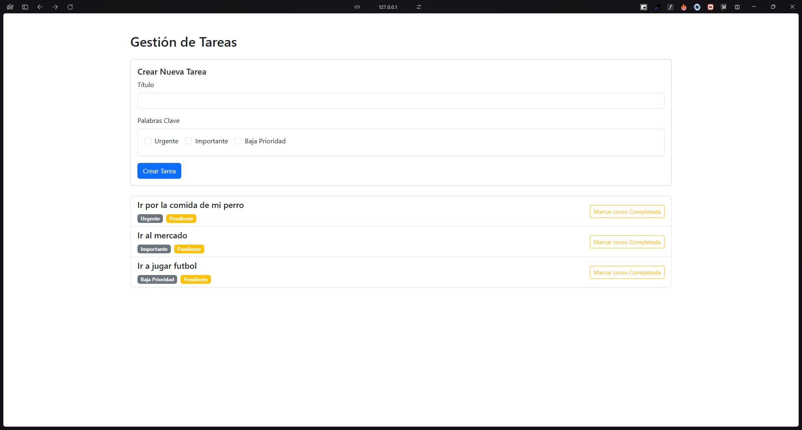
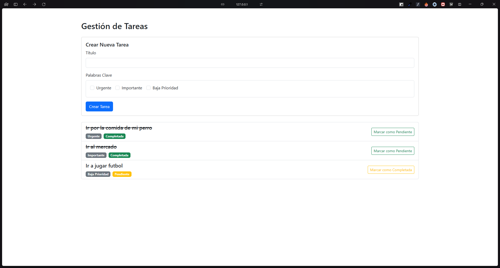
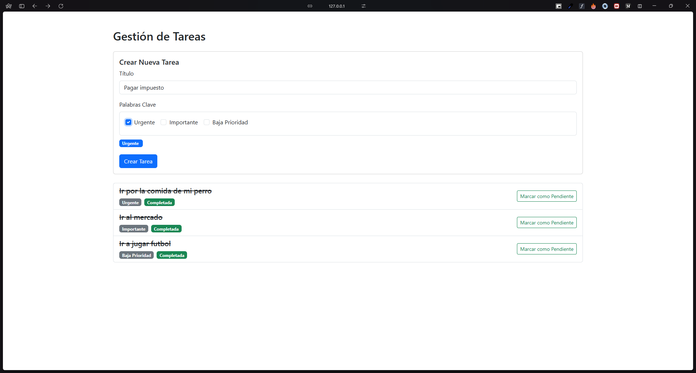

# Aplicación de Gestión de Tareas en Laravel

Una aplicación Laravel para gestionar tareas con palabras clave, con un frontend en Vue.js y base de datos SQLite.

## Características

- Creación y gestión de tareas
- Asociación de palabras clave con tareas
- Componentes Vue.js para interfaz de usuario dinámica
- Base de datos SQLite por simplicidad

## Prerrequisitos

- PHP 8.2 o superior
- Composer
- Node.js y npm
- SQLite (viene con PHP)

## Instalación

1. Clona el repositorio:
    ```
    git clone https://github.com/Nbravo1905/TaskTest
    cd TaskTest
    ```

2. Instala las dependencias de PHP:
    ```
    composer install
    ```

3. Instala las dependencias de JavaScript:
    ```
    npm install
    ```

4. Copia el archivo de entorno:
    ```
    cp .env.example .env
    ```

5. Genera la clave de la aplicación:
    ```
    php artisan key:generate
    ```

6. La aplicación utiliza SQLite como base de datos. El archivo de base de datos se creará automáticamente en `database/database.sqlite` durante el paso de migración.

7. Ejecuta las migraciones y seeders de la base de datos (importante para poblar la base de datos con datos iniciales como palabras clave):
    ```
    php artisan migrate --seed
    ```

8. Construye los activos del frontend:
    ```
    npm run build
    ```
    O para desarrollo:
    ```
    npm run dev
    ```

9. Inicia el servidor de desarrollo:
    ```
    php artisan serve
    ```

La aplicación estará disponible en `http://localhost:8000`.

## Uso

- Accede a la aplicación en tu navegador.
- Usa los componentes Vue.js para gestionar tareas y palabras clave.

## Base de Datos

Esta aplicación utiliza SQLite para la base de datos, que no requiere configuración adicional. El archivo de base de datos se almacena en `database/database.sqlite`.

## Frontend

El frontend está construido con Vue.js 3, integrado vía Vite para un desarrollo y construcción rápidos.

## Capturas de Pantalla

### Vista Previa 1


### Vista Previa 2


### Vista Previa 3


## Licencia

Este proyecto está licenciado bajo la Licencia MIT.